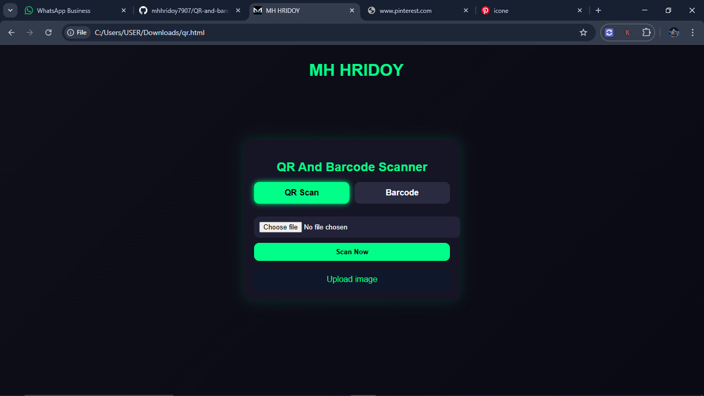
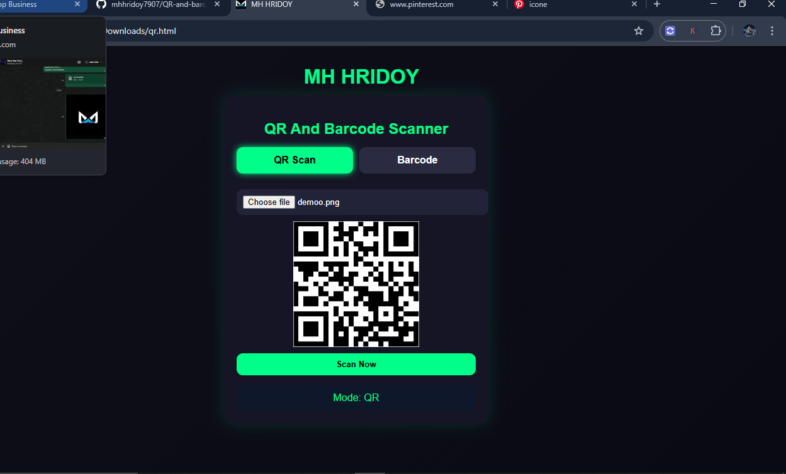

### Uplode Date: <i>29 April 2026</i>
# QR and Barcode Scanner

<div align="center">


A smart web-based QR Code and Barcode scanner that works with image upload (no camera required). Fast, lightweight, and fully browser-based.


</div>

### Demo View






---

## ✨ Features

- 🔍 **Dual-Mode Scanning** - Switch seamlessly between QR Code and Barcode scanning
- 📤 **Image Upload** - No camera required; scan from image files
- ⚡ **Fast & Lightweight** - Optimized for performance with minimal dependencies
- 🌐 **Browser-Based** - Works entirely in the browser; no server required
- 🎨 **Modern UI** - Beautiful gradient interface with smooth animations
- 🔗 **Link Detection** - Automatically detect and open URLs from QR codes
- 📱 **Responsive Design** - Works on desktop and mobile devices

---

## 🛠️ Tech Stack

| Technology | Purpose |
|---|---|
| **HTML5** | Semantic markup and structure |
| **CSS3** | Styling with gradients and animations |
| **JavaScript (Vanilla)** | Core scanning logic |
| **jsQR** | QR Code detection and decoding |
| **Quagga.js** | Barcode scanning and recognition |

---

## 📋 Supported Formats

### QR Codes
- Standard QR codes (v1-v40)
- URL links
- Text data

### Barcodes
- **CODE 128** - General-purpose barcode
- **EAN-13** - European Article Number (13-digit)
- **EAN-8** - Shortened EAN format
- **CODE 39** - Alphanumeric barcode

---

## 🚀 Getting Started

### Prerequisites
- Modern web browser (Chrome, Firefox, Safari, Edge)
- No additional software installation required

### Installation

1. **Clone the repository:**
```bash
git clone https://github.com/mhhridoy7907/QR-and-barcode-scanner.git
cd QR-and-barcode-scanner
```

2. **Open the application:**
   - Simply open `index.html` in your web browser
   - Or deploy to any static hosting service

### Usage

1. **Select Scanning Mode:**
   - Click "QR Scan" tab for QR Code scanning
   - Click "Barcode" tab for barcode scanning

2. **Upload Image:**
   - Click the file input area
   - Select an image containing a QR code or barcode

3. **Scan:**
   - Click the "Scan Now" button
   - View the detected code in the result box

4. **Open Links:**
   - If a URL is detected, click "Open Link" to visit it

---

## 📂 Project Structure

```
QR-and-barcode-scanner/
│
├── index.html          # Main HTML file 
├── style.css
├── funtion.js
├── README.md           # Project documentation
└── LICENSE             # Project license
```

---

## 🎯 How It Works

### QR Code Scanning
- Uses **jsQR** library to analyze image pixel data
- Detects QR patterns and decodes the embedded data
- Supports URLs, text, and structured data

### Barcode Scanning
- Uses **Quagga.js** library for barcode recognition
- Supports multiple barcode standards
- Optimized for 1D barcodes

### Image Processing Flow
```
Image Upload → Canvas Rendering → Pixel Data Extraction → Pattern Recognition → Result Display
```

---

## 🔧 Configuration

The scanner can be customized by modifying the JavaScript section:

- **Barcode Readers:** Adjust the `readers` array in the Quagga decoder configuration
- **UI Colors:** Modify CSS variables in the `<style>` section
- **Canvas Size:** Automatically matches uploaded image dimensions

---

## 🐛 Troubleshooting

| Issue | Solution |
|---|---|
| QR Code not detected | Ensure image is clear, well-lit, and not rotated |
| Barcode not recognized | Try a different barcode format or clearer image |
| File not uploading | Check browser file input permissions |

---

## 📱 Browser Support

| Browser | Support |
|---|---|
| Chrome | ✅ Latest |
| Firefox | ✅ Latest |
| Safari | ✅ Latest |
| Edge | ✅ Latest |
| IE 11 | ⚠️ Limited support |

---

## 📄 License

This project is licensed under the MIT License - see the LICENSE file for details.

---

## 🤝 Contributing

Contributions are welcome! Here's how you can help:

1. **Fork** the repository
2. **Create** a feature branch (`git checkout -b feature/AmazingFeature`)
3. **Commit** your changes (`git commit -m 'Add AmazingFeature'`)
4. **Push** to the branch (`git push origin feature/AmazingFeature`)
5. **Open** a Pull Request

### Development Guidelines
- Follow existing code style
- Test changes across browsers
- Update documentation as needed
- Keep dependencies minimal

---

## 📞 Support & Contact

- 📧 Email: [mhhridoy7907@gmail.com]

- WhatsApp: [ +880 19623 88570 ]

---


<div align="center">

**[⬆ back to top](#qr-and-barcode-scanner)**

Made with  by [MH HRIDOY](https://github.com/mhhridoy7907)

</div>
